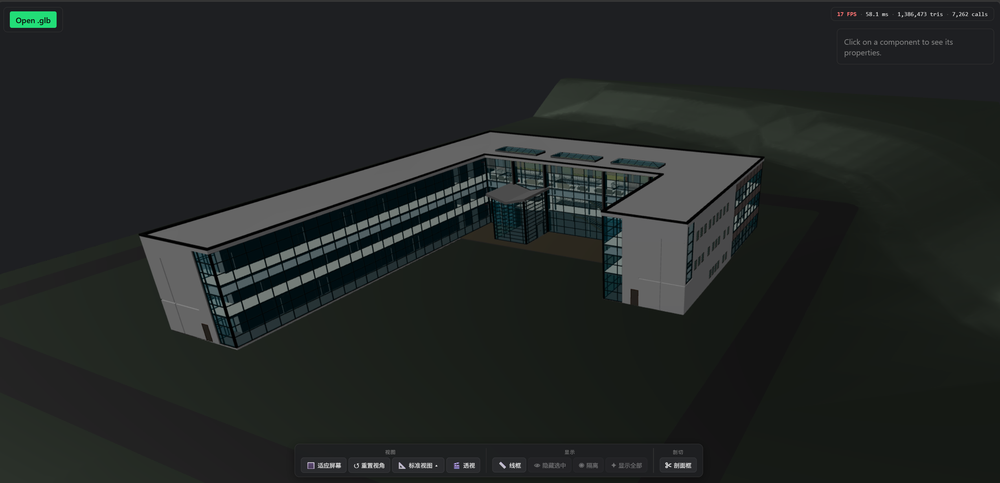
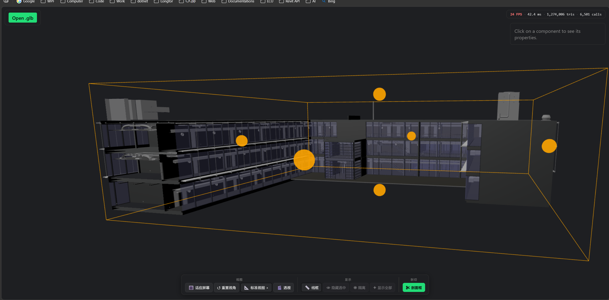
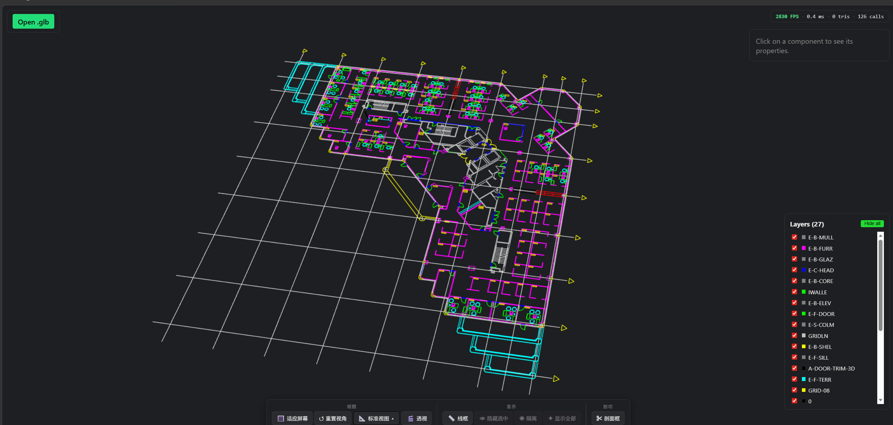

# Revit/AutoCAD GLB 导出插件与 Web 查看器

本仓库包含四个主要部分：

- `RevitGltfExporter`：Revit 2019 插件，用于导出 `.glb` 文件。
- `AutoCadGltfExporter`：AutoCAD 插件，用于将当前 DWG 导出为 `.glb` 文件。
- `draco_encoder_wrapper`：基于 Draco 的原生压缩 DLL，供导出插件通过 P/Invoke 调用。
- `web-viewer`：基于 Vite + React + TypeScript + three.js 的前端 GLB 查看器。

## 展示





## 实现文档

- [Revit 导出 GLB 实现文档](docs/revit-glb-export-implementation.md)
- [AutoCAD 导出 GLB 实现文档](docs/autocad-glb-export-implementation.md)

## 环境要求

建议在 Windows 64-bit 环境下编译和安装插件。

- Windows 64-bit
- Revit 2019
- AutoCAD 2020-2024
- Visual Studio 2022 或可用的 MSBuild
- CMake
- PowerShell
- Node.js
- pnpm 9

> Revit 插件项目默认查找 Revit API 的路径为 `C:\Program Files\Autodesk\Revit 2019`。如果 Revit 安装在其他目录，需要在构建时覆盖 `RevitInstallPath`。

> AutoCAD 插件项目会自动查找 `C:\Program Files\Autodesk\AutoCAD 2020` 到 `AutoCAD 2024`，如果 AutoCAD 安装在其他目录，需要在构建时覆盖 `AutoCadInstallPath`。

## 编译 Draco 原生库

`draco_encoder_wrapper` 会编译出 `draco_encoder.dll`，启用 Draco 压缩时该 DLL 必须和对应导出插件 DLL 放在同一目录下。

在仓库根目录打开 PowerShell，执行：

```powershell
cd .\draco_encoder_wrapper
powershell -ExecutionPolicy Bypass -File .\build.ps1 -Config Release
```

编译完成后，脚本会将 DLL 复制到：

```text
output\draco_encoder.dll
```

如果需要 Debug 版本，可以执行：

```powershell
cd .\draco_encoder_wrapper
powershell -ExecutionPolicy Bypass -File .\build.ps1 -Config Debug
```

## 编译 Revit 插件

编译 Revit 插件前，请先完成 Draco 原生库编译，确保以下文件存在：

```text
output\draco_encoder.dll
```

### 使用 Visual Studio 编译

1. 打开解决方案：

   ```text
   RevitGltfExporter\RevitGltfExporter.sln
   ```

2. 选择构建配置：

   ```text
   Release | x64
   ```

   或：

   ```text
   Debug | x64
   ```

3. 执行 Build。

插件编译产物会输出到：

```text
output\RevitGltfExporter.dll
```

### 使用 MSBuild 编译

如果 Revit 安装在默认路径，可以在仓库根目录执行：

```powershell
msbuild .\RevitGltfExporter\RevitGltfExporter.sln /p:Configuration=Release /p:Platform=x64
```

如果 Revit 安装在其他路径，通过 `RevitInstallPath` 覆盖：

```powershell
msbuild .\RevitGltfExporter\RevitGltfExporter.sln /p:Configuration=Release /p:Platform=x64 /p:RevitInstallPath="D:\Autodesk\Revit 2019"
```

如果编译 Debug 插件并使用 Debug 版本的 Draco DLL，需要同时指定：

```powershell
msbuild .\RevitGltfExporter\RevitGltfExporter.sln /p:Configuration=Debug /p:Platform=x64 /p:DracoEncoderConfiguration=Debug
```

## 安装到 Revit 2019

Revit 通过 `.addin` 文件加载插件。插件安装目录为：

```text
%ProgramData%\Autodesk\Revit\Addins\2019\
```

如果目录不存在，请先创建。

### 创建 addin 文件

在下面目录中新建文件：

```text
%ProgramData%\Autodesk\Revit\Addins\2019\RevitGltfExporter.addin
```

文件内容示例：

```xml
<?xml version="1.0" encoding="utf-8"?>
<RevitAddIns>
  <AddIn Type="Application">
    <Name>RevitGltfExporter</Name>
    <Assembly>C:\path\to\gltf_revit\output\RevitGltfExporter.dll</Assembly>
    <AddInId>4f8e3a1b-0a6d-4d1a-9a5e-7f2a1c9d3e4f</AddInId>
    <FullClassName>RevitGltfExporter.Application</FullClassName>
    <VendorId>LOCAL</VendorId>
    <VendorDescription>Internal</VendorDescription>
  </AddIn>
</RevitAddIns>
```

请将 `<Assembly>` 修改为本机仓库中 `RevitGltfExporter.dll` 的绝对路径，例如：

```xml
<Assembly>C:\work\gltf_revit\output\RevitGltfExporter.dll</Assembly>
```

安装时请确认 `output` 目录中至少包含：

```text
output\RevitGltfExporter.dll
output\draco_encoder.dll
```

`draco_encoder.dll` 必须和 `RevitGltfExporter.dll` 位于同一目录，否则启用 Draco 压缩导出时会加载失败。

完成后启动 Revit 2019，在 Add-Ins/插件入口中使用 GLB 导出命令。

## 编译 AutoCAD 插件

编译 AutoCAD 插件前，建议先完成 Draco 原生库编译，确保以下文件存在：

```text
output\draco_encoder.dll
```

如果不启用 Draco 压缩，插件仍可导出未压缩 GLB；如果启用 Draco 压缩，`draco_encoder.dll` 必须和 AutoCAD 插件 DLL 位于同一目录。

### 使用 Visual Studio 编译

1. 打开解决方案：

   ```text
   AutoCadGltfExporter\AutoCadGltfExporter.sln
   ```

2. 选择构建配置：

   ```text
   Release | x64
   ```

   或：

   ```text
   Debug | x64
   ```

3. 执行 Build。

插件编译产物会输出到：

```text
output\AutoCadGltfExporter.dll
```

同时会生成可直接部署的 AutoCAD Autoloader bundle：

```text
output\AutoCadGltfExporter.bundle
```

bundle 结构如下：

```text
AutoCadGltfExporter.bundle\
  PackageContents.xml
  Contents\
    AutoCadGltfExporter.dll
    GltfExporter.Shared.dll
    Newtonsoft.Json.dll
    draco_encoder.dll
```

### 使用 MSBuild 编译

如果 AutoCAD 安装在项目默认可检测路径，可以在仓库根目录执行：

```powershell
msbuild .\AutoCadGltfExporter\AutoCadGltfExporter.sln /p:Configuration=Release /p:Platform=x64
```

如果 AutoCAD 安装在其他路径，通过 `AutoCadInstallPath` 覆盖：

```powershell
msbuild .\AutoCadGltfExporter\AutoCadGltfExporter.sln /p:Configuration=Release /p:Platform=x64 /p:AutoCadInstallPath="D:\Autodesk\AutoCAD 2024"
```

## 安装到 AutoCAD

推荐使用 AutoCAD Autoloader 方式加载插件。将整个 bundle 目录复制到以下任一目录：

```text
%AppData%\Autodesk\ApplicationPlugins\
%ProgramData%\Autodesk\ApplicationPlugins\
%ProgramFiles%\Autodesk\ApplicationPlugins\
```

例如复制后目录应为：

```text
%AppData%\Autodesk\ApplicationPlugins\AutoCadGltfExporter.bundle\
```

安装时请确认 bundle 中至少包含：

```text
AutoCadGltfExporter.bundle\PackageContents.xml
AutoCadGltfExporter.bundle\Contents\AutoCadGltfExporter.dll
AutoCadGltfExporter.bundle\Contents\GltfExporter.Shared.dll
AutoCadGltfExporter.bundle\Contents\Newtonsoft.Json.dll
```

如果导出时启用 Draco 压缩，还需要：

```text
AutoCadGltfExporter.bundle\Contents\draco_encoder.dll
```

完成后重启 AutoCAD。插件加载成功时，命令行会显示：

```text
AutoCadGltfExporter loaded. Use the EXPORTGLB command to export the current drawing.
```

## 使用 AutoCAD 导出 GLB

1. 在 AutoCAD 中打开需要导出的 DWG。
2. 确认需要导出的对象位于 ModelSpace，且对象可见。
3. 在命令行输入：

   ```text
   EXPORTGLB
   ```

4. 在导出选项窗口中选择是否启用 Draco 压缩、是否包含属性。
5. 在保存文件窗口中选择 `.glb` 输出路径。
6. 等待命令行显示导出完成信息。

AutoCAD 导出器会按 DWG 的 `INSUNITS` 将模型单位转换为米，并将 AutoCAD 的 Z-up 坐标转换为 glTF 的 Y-up 坐标。当前实现遍历 ModelSpace 中的可见实体，支持 3D 实体、曲线、文字/标注展开、填充和块参照。

## 启动前端项目

前端项目位于 `web-viewer`，使用 pnpm 管理依赖。

在仓库根目录执行：

```powershell
cd .\web-viewer
pnpm install
pnpm dev
```

开发服务器默认监听：

```text
http://localhost:5173
```

如果需要生产构建：

```powershell
pnpm build
```

构建完成后，可以本地预览：

```powershell
pnpm preview
```

## 常见问题

### 编译 Revit 插件提示找不到 `draco_encoder.dll`

请先编译 Draco 原生库：

```powershell
cd .\draco_encoder_wrapper
powershell -ExecutionPolicy Bypass -File .\build.ps1 -Config Release
```

然后重新编译 Revit 插件。

### 编译 Revit 插件提示找不到 `RevitAPI.dll`

确认已安装 Revit 2019，并检查安装路径。项目默认路径为：

```text
C:\Program Files\Autodesk\Revit 2019
```

如果安装在其他目录，请在 MSBuild 中传入：

```powershell
/p:RevitInstallPath="你的 Revit 2019 安装目录"
```

### Revit 启动后没有看到插件

请检查：

- `.addin` 文件是否位于 `%ProgramData%\Autodesk\Revit\Addins\2019\`。
- `.addin` 文件中的 `<Assembly>` 是否为 `RevitGltfExporter.dll` 的绝对路径。
- `output\RevitGltfExporter.dll` 是否存在。
- `output\draco_encoder.dll` 是否和插件 DLL 在同一目录。

### 编译 AutoCAD 插件提示找不到 `acdbmgd.dll`

确认已安装 AutoCAD，并检查安装路径。项目会自动查找 AutoCAD 2020-2024 的默认安装目录。

如果安装在其他目录，请在 MSBuild 中传入：

```powershell
/p:AutoCadInstallPath="你的 AutoCAD 安装目录"
```

### AutoCAD 启动后没有看到 `EXPORTGLB` 命令

请检查：

- `AutoCadGltfExporter.bundle` 是否整个目录复制到了 AutoCAD Autoloader 目录。
- `PackageContents.xml` 是否位于 bundle 根目录。
- `AutoCadGltfExporter.dll` 是否位于 `AutoCadGltfExporter.bundle\Contents\`。
- 复制完成后是否已重启 AutoCAD。

### AutoCAD 导出 Draco GLB 失败

请确认以下文件和 `AutoCadGltfExporter.dll` 位于同一目录：

```text
AutoCadGltfExporter.bundle\Contents\draco_encoder.dll
```
