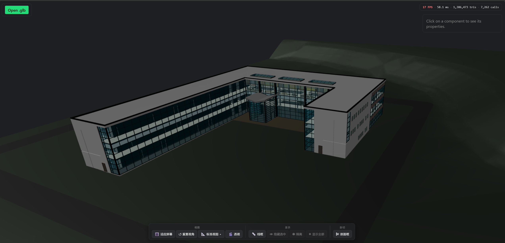
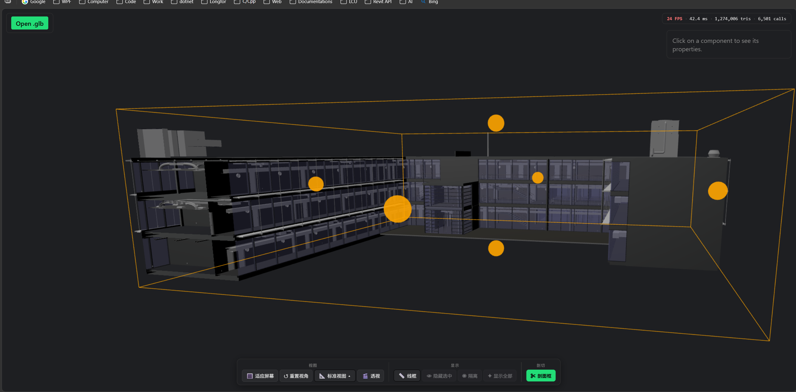
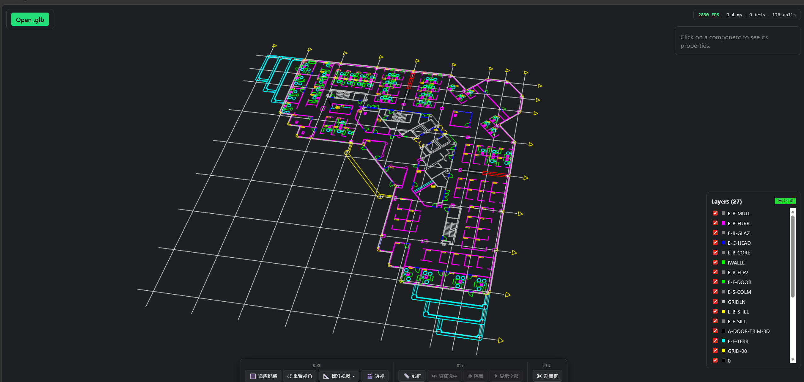

# 🏗️ Revit / AutoCAD GLB 导出器与 Web 查看器

🎯 本项目用于将 Revit 或 AutoCAD 模型导出为标准 `.glb` 文件，并在浏览器中查看模型、构件属性和图层信息。

## ✨ 功能介绍

### 🏢 Revit GLB 导出器

- 🧭 支持 Revit 2019–2027，导出当前激活的三维视图。
- 🧱 导出模型几何、材质以及构件层级。
- 🏷️ 可将构件类别、族、类型和参数写入 glTF `extras`。
- 🗜️ 可选 Draco 几何压缩，并支持设置压缩等级。
- 📐 自动将 Revit 的英尺、Z-up 坐标转换为 glTF 使用的米、Y-up 坐标。

### 📐 AutoCAD GLB 导出器

- 🗺️ 支持 AutoCAD 2020–2024，导出当前 DWG 的 ModelSpace 内容。
- 🧊 支持三维实体、曲面、曲线、文字、标注、填充和块参照等对象。
- 🏷️ 保留图层、颜色、实体句柄和 XData 等信息。
- 🔄 根据 DWG 的 `INSUNITS` 转换为米，并将 Z-up 坐标转换为 Y-up。
- 🗜️ 可选对三维网格启用 Draco 压缩。

### 🌐 Web GLB 查看器

- 📂 从本地打开普通或 Draco 压缩的 `.glb` 文件。
- 🖱️ 支持旋转、缩放、平移、适应屏幕和标准视图。
- 🎥 支持透视/正交相机、线框显示、隐藏、隔离和显示全部。
- ✂️ 支持按图层控制可见性、交互式剖面框和构件属性查看。
- 📊 实时显示 FPS、帧耗时、三角形数量和 Draw Call。

## 🖼️ 界面预览

导出的 GLB 文件可以直接在 Web 查看器中打开，并根据使用场景切换不同的查看方式：

### 🏢 建筑模型浏览



查看建筑整体模型，使用鼠标进行旋转、缩放和平移，并在右上角观察实时性能指标。

### ✂️ 剖面框查看



启用剖面框后，可以拖动边界和控制点裁切模型，用于查看建筑内部空间和构件关系。

### 🗂️ AutoCAD 图层查看



AutoCAD 导出的模型会保留图层信息，可以在右侧图层面板中单独显示或隐藏图层。

## 📁 项目组成

| 目录 | 说明 |
| --- | --- |
| `src/RevitGltfExporter` | Revit 2019–2027 参数化导出插件 |
| `src/AutoCadGltfExporter` | AutoCAD 2020–2024 导出插件 |
| `src/Shared` | 两个导出器共用的 glTF/GLB 构建代码 |
| `src/draco_encoder_wrapper` | Draco 原生编码 DLL |
| `src/web-viewer` | React + three.js Web 查看器 |

## 🛠️ 源码编译

### 💻 环境要求

- Windows 64 位
- Visual Studio 2022/2026 或 Build Tools（包含 MSBuild、.NET 桌面开发和 C++ 桌面开发工具；在 VS 内构建 Revit 2027 需要支持 .NET 10 的 Visual Studio 2026，也可使用 .NET 10 SDK 命令行构建）
- .NET Framework 4.8 Developer Pack
- .NET 8 SDK（构建 Revit 2025–2026 时需要）
- .NET 10 SDK（构建 Revit 2027 时需要）
- CMake
- 目标版本的 Revit（仅使用本机 API 引用、F5 调试或手工验证时需要）
- AutoCAD 2020–2024 任一版本（编译 AutoCAD 插件时需要）
- Node.js 和 pnpm 9（编译 Web 查看器时需要）

以下命令均在仓库根目录的 PowerShell 中执行。

### 1️⃣ 编译 Draco 原生库

两个导出插件都依赖 `draco_encoder.dll`，因此应先编译它：

```powershell
New-Item -ItemType Directory -Path .\output -Force | Out-Null
powershell -ExecutionPolicy Bypass -File .\src\draco_encoder_wrapper\build.ps1 -Config Release
```

首次构建会下载经过 SHA256 校验的 Draco 1.5.7 官方源码归档，并缓存到 `src\draco_encoder_wrapper\build\_deps`。离线环境可预先准备同版本源码并指定目录：

```powershell
powershell -ExecutionPolicy Bypass -File .\src\draco_encoder_wrapper\build.ps1 -Config Release -DracoSourceDir D:\deps\draco-1.5.7
```

✅ 产物将复制到 `output\draco_encoder.dll`。

### 2️⃣ 编译 Revit 插件

Revit 插件只有一个 SDK-style `.csproj`。在 Visual Studio 中打开 `src\RevitGltfExporter\RevitGltfExporter.slnx`，选择目标年份配置（例如 `Revit2025-Release | x64`）后构建；也可以在 Developer PowerShell 中执行：

```powershell
msbuild .\src\RevitGltfExporter\RevitGltfExporter\RevitGltfExporter.csproj /restore /m /p:Configuration=Release /p:Platform=x64 /p:RevitVersion=2025
```

默认通过 `Revit_All_Main_Versions_API_x64` NuGet 包引用目标版本的编译期 API，包版本固定为 `<RevitVersion>.0.0`（例如 Revit 2019 使用 `2019.0.0`）。需要使用本机 Revit SDK 校验时，增加：

```powershell
/p:UseLocalRevitReferences=true /p:RevitInstallPath="D:\Autodesk\Revit 2025"
```

✅ 主要产物为 `output\Revit2025\RevitGltfExporter.2025.dll`。2019–2024 配置自动使用 `net48`，2025–2026 使用 `net8.0-windows`，2027 使用 `net10.0-windows`；每个版本仍输出到独立的 `output\Revit<version>\` 目录。

Visual Studio 的 Configuration Manager 提供 `Revit2019-Debug` 至 `Revit2027-Release` 的版本专用配置。配置名称中的年份会自动设置 `RevitVersion`，并选择目标框架、API 包、条件编译符号、输出目录和对应的 `Revit.exe` 调试启动路径。`Debug`/`Release` 后缀仍分别控制调试符号和优化选项。编译或 F5 调试前请关闭目标 Revit，避免已加载的插件 DLL 被锁定。

### 3️⃣ 编译 AutoCAD 插件

在 Visual Studio 中打开 `src\AutoCadGltfExporter\AutoCadGltfExporter.slnx`，选择 `Release | x64` 后构建；也可以执行：

```powershell
msbuild .\src\AutoCadGltfExporter\AutoCadGltfExporter.slnx /m /p:Configuration=Release /p:Platform=x64
```

项目会自动查找 AutoCAD 2020–2024。安装在其他目录时，增加：

```powershell
/p:AutoCadInstallPath="D:\Autodesk\AutoCAD 2024"
```

✅ 主要产物为：

```text
output\AutoCadGltfExporter.dll
output\AutoCadGltfExporter.bundle\
```

### 4️⃣ 编译 Web 查看器

```powershell
cd .\src\web-viewer
pnpm install
pnpm build
```

✅ 生产构建输出到 `src\web-viewer\dist`。本地开发可运行 `pnpm dev`，默认访问 `http://localhost:5173`。

## 🚢 发布安装包

推送 `v主版本.次版本.修订号` 格式的 tag（例如 `v1.2.3`）后，GitHub Actions 会构建 Draco、Revit 2019–2027 插件和 AutoCAD 2020–2024 插件，并自动创建 GitHub Release。Release 包含九个 Revit x64 MSI、一个 AutoCAD x64 MSI 和 `SHA256SUMS.txt`；Web Viewer 不参与此发布流程。

```powershell
git tag v1.2.3
git push origin v1.2.3
```

本地可使用相同脚本复现安装包构建，产物位于 `release\`：

```powershell
powershell -ExecutionPolicy Bypass -File .\scripts\build-release.ps1 -Version v1.2.3
```

该命令默认构建 Revit 2019–2027 九个 MSI 和一个 AutoCAD MSI。若只需发布指定 Revit 版本，可传入 `-RevitVersions 2025`；发布资产文件名包含 Revit 年份。

## 📦 安装插件

### ⚡ 一键构建并安装

管理员 PowerShell 中执行：

```powershell
powershell -ExecutionPolicy Bypass -File .\scripts\install-plugins.ps1
```

🚀 该脚本会依次构建 Draco、Revit 插件和 AutoCAD 插件，并安装到 Revit 的 Addins 目录。也可以只安装其中一个：

```powershell
powershell -ExecutionPolicy Bypass -File .\scripts\install-plugins.ps1 -Target Revit -RevitYears 2019,2025,2027
powershell -ExecutionPolicy Bypass -File .\scripts\install-plugins.ps1 -Target AutoCAD
```

默认 Revit 构建不需要本机安装目录；需要使用本机 API 编译时，增加 `-UseLocalRevitReferences -RevitInstallPath`（多版本使用 `-RevitInstallPaths`）。AutoCAD 仍可通过 `-AutoCadInstallPath` 指定安装路径。

### 🏢 手动安装 Revit 插件

1. 构建目标版本，例如 `RevitVersion=2025`，生成 `output\Revit2025\RevitGltfExporter.2025.dll`。
2. 将该目录中的 `.addin` 文件复制到 `%AppData%\Autodesk\Revit\Addins\2025\`。
3. 确认对应目录中的 `RevitGltfExporter.2025.dll`、`RevitGltfExporter.2025.deps.json`、`GltfExporter.Shared.dll`、`Newtonsoft.Json.dll` 和 `draco_encoder.dll` 位于同一目录。
4. 重启 Revit。

### 📐 手动安装 AutoCAD 插件

将整个 `output\AutoCadGltfExporter.bundle` 复制到以下任一目录，然后重启 AutoCAD：

```text
%AppData%\Autodesk\ApplicationPlugins\
%ProgramData%\Autodesk\ApplicationPlugins\
```

## 🚀 功能使用

### 🏢 从 Revit 导出 GLB

1. 打开 Revit 模型并切换到需要导出的三维视图。
2. 依次打开 `GLB Tools` → `Export` → `Export GLB`。
3. 选择是否启用 Draco 压缩、压缩等级以及是否包含构件参数。
4. 选择保存位置，等待导出完成。

💡 Revit 导出器只导出当前三维视图中可见的模型内容；二维视图不能执行导出。

### 📐 从 AutoCAD 导出 GLB

1. 打开 DWG，确认待导出对象位于 ModelSpace 且可见。
2. 在命令行输入 `EXPORTGLB`。
3. 选择是否启用 Draco 压缩以及是否包含实体属性。
4. 选择保存位置，等待命令行提示导出完成。

### 🌐 在 Web 查看器中查看 GLB

启动开发服务器：

```powershell
cd .\src\web-viewer
pnpm install
pnpm dev
```

🌐 浏览器打开 `http://localhost:5173`，点击左上角 `Open .glb` 选择导出的文件。加载后可以：

- 🖱️ 鼠标旋转、平移和缩放模型；
- 🔎 点击构件查看属性；
- 👁️ 按图层显示或隐藏对象；
- 🧰 使用底部工具栏切换视图、线框、隐藏、隔离和剖面框。

## ⚠️ 注意事项

- 🗜️ 启用 Draco 时，`draco_encoder.dll` 必须与插件 DLL 位于同一目录。
- 🔧 Revit 或 AutoCAD API 引用缺失时，请检查产品安装目录，并通过对应的 MSBuild 属性覆盖默认路径。
- 🔁 插件安装或更新后，应重启 Revit/AutoCAD。

## 📚 相关文档

- [Revit GLB 导出实现](docs/revit-glb-export-implementation.md)
- [AutoCAD GLB 导出实现](docs/autocad-glb-export-implementation.md)
- [性能优化说明](docs/performance-optimization.md)
